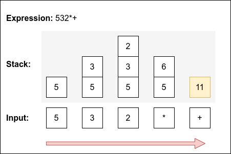

# Algoritmos e Tipos Abstratos de Dados

## Lab 8 | Exercícios + Template  

:gb: [English version](README_en.md)

Este repositório foi criado a partir de:

- <https://github.com/estsetubal-atad/CProgram_Template> 

Consulte o README se tiver dúvidas sobre a sua utilização.

----

**Objetivos**:

- Implementação de uma calculadora de expressões matemáticas;

- Utilização do ADT Queue e ADT Stack.

**Referências**:

- “Tipos Abstratos de Dados – Linguagem C. Bruno Silva”, disponível no Moodle.

- [Notação Polaca Inversa - Wikipedia](https://pt.wikipedia.org/wiki/Nota%C3%A7%C3%A3o_polonesa_inversa)

---

:computer: Faça o clone **deste** repositório antes de avançar.

:bulb: Este projeto contém o ADT Stack e o ADT Queue, que devem ser parameterizados adequadamente conforme indicado.

### Nível 1 (Duração estimada: 10min)

1. Parameterize o:

- `ADT Queue` de forma a armazenar elementos do tipo `char`;

- `ADT Stack` de forma a armazenar elementos do tipo `int`.

2. Complemente o `makefile` de forma a utilizar todos os módulos existentes no projeto.

### Nível 2 (Duração estimada: 15min)

3. Implemente a função `PtQueue expr2queue(char *expr)` no ficheiro `calculator.c` - o seu propósito é devolver uma *fila* com todos os caracteres em `expr`, ignorando espaços; na fila resultante, **a expressão deverá ficar rodeada de parêntesis**: 

    - Se `expr = "7 /2"`, então o conteúdo da fila - da frente para o final - será `(7/2)`.  

    - Se `expr = "5 + (3 * 2)"`, então o conteúdo da fila - da frente para o final - será `(5+(3*2))`.  

    **Não é necessário** fazer nenhum tipo de validação, e.g., balanceamento de parentesis. Esta função será utilizada no nível seguinte.

### Nível 3 (Duração estimada: 35min)

4. Leia a **Adenda - Conversão de expressão *Infix* para *Postfix***;

5. Implemente a função `char* infix2postfix(char *infixExpr)` de acordo com o algoritmo descrito no passo anterior;

6. Complemente o `main` por forma a utilizar/testar a função anterior. Valide adicionalmente os seguintes resultados esperados:

    Infix | Postfix
    ---- | ----
    `5 + 7 * 9 - 4` | `579*+4-`
    `(5 + 7) * (9 - 4)` | `57+94-*`
    `5 * (6 + 3) / 3` | `563+*3/`
    `(3 + 7) - 6 / 2` | `37+62/-`

### Nível 4 (Duração estimada: 35min)

7. Leia a **Adenda -  Cálculo de expressão *Postfix***;

8. Implemente a função `int computePostfixExpression(char *postfixExpr)` de acordo com o algoritmo descrito no passo anterior;

9. Complemente o `main` por forma a utilizar/testar a função anterior. A função deve receber o *output* da função `infix2postfix`. Verifique a correção dos resultados para as expressões introduzidas.

### Nível 5 (Duração estimada: 10min)

10. Analise o programa através do *Valgring* e verifique que é feita a correta gestão de memória dinâmica. Corrija o necessário para garantir que não existem *memory leaks*.

### Adenda

#### Conversão de expressão *Infix* para *Postfix*

Este algoritmo (em linguagem natural) opera sobre uma *fila* `FI`, resultante da função ` expr2queue`, utiliza uma *fila temporária* `FP` e uma *pilha temporária* `S` e produz uma *string* `P` - contendo a expressão em formato posfixo.

>
>- Enquanto a fila FI não está vazia, remover um elemento e:
>
>    1. Se o elemento for um dígito, adicioná-lo à fila FP.
>
>    2. Se o elemento for um parêntesis esquerdo ‘(‘, inseri-lo na pilha S.
>
>    3. Se o elemento for um operador ('+', '-', '*' ou '/') então:
>
>        a. Retirar os elementos da pilha S e adicioná-los à fila FP repetidamente enquanto estes tiverem a mesma ou precedência superior ao operador atual.
>
>        b. Inserir o operador encontrado na pilha S.
>
>    4. Se o elemento for um parêntesis direito ‘)’ então:
>
>        a. Retirar os elementos da pilha S e adicioná-los à fila FP repetidamente até se encontrar um parêntesis esquerdo ‘(‘.
>
>        b. Remover o parêntesis esquerdo da pilha. Não o adicione à fila FP.
>
>- Remova todos os elementos da fila FP para a expressão P.
>

**Exemplo do algoritmo para `(5+(3*2))`**:

| `Queue FI`  | `Stack S` | `Queue FP` |
|-------------|-----------|------------|
| `(5+(3*2))` | `empty`   | `empty`    |
| `5+(3*2))`  | `(`       | `empty`    |
| `+(3*2))`   | `(`       | `5`        |
| `(3*2))`    | `(+`      | `5`        |
| `3*2))`     | `(+(`     | `5`        |
| `*2))`      | `(+(`     | `53`       |
| `2))`       | `(+(*`    | `53`       |
| `))`        | `(+(*`    | `532`      |
| `)`         | `(+`      | `532*`     |
| `empty`     | `empty`   | `532*+`    |


#### Cálculo de expressão *Postfix*

Este algoritmo (em linguagem natural) opera sobre uma *string* `expr` (expressão posfixa) - resultante da função `infix2postfix`, utiliza uma *pilha temporária* `S` e produz resultado *inteiro* - o cálculo numérico da expressão:

**Algoritmo**

>
>- Processar cada caractere da expressão 'expr' da esquerda para a direita:
>    
>    1. Se o caractere for um dígito, inseri-lo na pilha S.
>    
>    2. Se o caractere for um operador, retirar dois valores A e B da pilha, calcular (B <operador> A) e inserir o resultado na pilha - atente à ordem dos operandos!
>
>- No final, o valor que permanecer na pilha é o resultado da expressão.
>
>
> Se o estado da pilha em algum dos momentos anteriores não for "válido", i.e., não permitir remover dois elementos ou ficar com mais de um elemento no final da expressão, então essa expressão é incorreta.
>

**Exemplo do algoritmo para `532*+`**:



---

```markdown
@bruno.silva
(EOF)
``` 