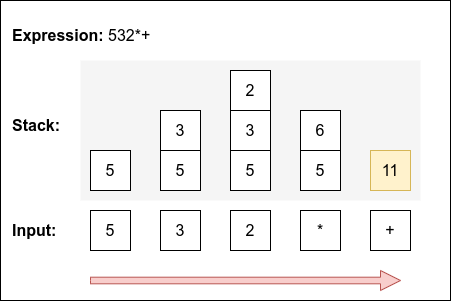

# Algorithms and Abstract Data Types

## Lab 8 \| Exercises + Template

🇬🇧 [English version](README_en.md)

This repository was created from:

- <https://github.com/estsetubal-atad/CProgram_Template>

Consult the README if you have questions about its use.

------------------------------------------------------------------------

Goals:

- Implementation of a mathematical expression calculator;

- Use of ADT Queue and ADT Stack.

References:

- “Abstract Data Types – Language C. Bruno Silva”, available on Moodle.

- [Notação Polaca Inversa - Wikipedia](https://pt.wikipedia.org/wiki/Nota%C3%A7%C3%A3o_polonesa_inversa)

------------------------------------------------------------------------

💻 Clone this repository before moving forward.

💡 This project contains the ADT Stack and the ADT Queue, which must be properly parameterized as indicated.

### Level 1 (Estimated duration: 10min)

1.  Parameterize o:

- `ADT Queue` in order to store elements of type `char` ;

- `ADT Stack` in order to store elements of type `int` .

2.  Complement `makefile` in order to use all existing modules in the project.

### Level 2 (Estimated duration: 15min)

3.  Implement function `PtQueue expr2queue(char *expr)` in file `calculator.c` - its purpose is to return a string of all characters in `expr` , ignoring spaces; in the resulting row, the expression must be surrounded by parentheses:

    - If `expr = "7 /2"` , then the contents of the queue - front to back - will be `(7/2)` .

    - If `expr = "5 + (3 * 2)"` , then the contents of the queue - front to back - will be `(5+(3*2))` .

    It is not necessary to do any kind of validation, eg balancing parentheses. This function will be used in the next level.

### Level 3 (Estimated duration: 35min)

4.  Read the Addendum - Infix to Postfix Expression Conversion;

5.  Implement function `char* infix2postfix(char *infixExpr)` according to the algorithm described in the previous step;

6.  Complement `main` in order to use/test the previous function. Additionally validate the following expected results:

    | Infix               | Postfix   |
    |---------------------|-----------|
    | `5 + 7 * 9 - 4`     | `579*+4-` |
    | `(5 + 7) * (9 - 4)` | `57+94-*` |
    | `5 * (6 + 3) / 3`   | `563+*3/` |
    | `(3 + 7) - 6 / 2`   | `37+62/-` |

### Level 4 (Estimated duration: 35min)

7.  Read Addendum - Postfix Expression Calculation;

8.  Implement function `int computePostfixExpression(char *postfixExpr)` according to the algorithm described in the previous step;

9.  Complement `main` in order to use/test the previous function. The function must receive the output of function `infix2postfix` . Check the correctness of the results for the entered expressions.

### Level 5 (Estimated duration: 10min)

10. Analyze the program through Valgring and check that the dynamic memory management is correct. Fix as necessary to ensure there are no memory leaks.

### Addendum

#### Infix expression conversion to Postfix

This algorithm (in natural language) operates on a queue `FI` , resulting from function ` expr2queue` , uses a temporary queue `FP` and a temporary stack `S` and produces a string `P` - containing the expression in postfix format.

> - While the FI queue is not empty, remove an element and:
>
>   1.  If the element is a digit, add it to the FP queue.
>
>   2.  If the element is a left parenthesis '(', insert it into the S stack.
>
>   3.  If the element is an operator ('+', '-', '\*' or '/') then:
>
>       The. Pop elements from the S stack and add them to the FP queue repeatedly as long as they have the same or higher precedence than the current operator.
>
>       B. Insert the found operator into the S stack.
>
>   4.  If the element is a right parenthesis ')' then:
>
>       The. Take the elements from the S stack and add them to the FP queue repeatedly until you find a left parenthesis '('.
>
>       B. Remove the left parenthesis from the stack. Do not add it to the FP queue.
>
> - Remove all elements from the FP queue for the P expression.

Algorithm example for `(5+(3*2))` :

| `Queue FI`  | `Stack S` | `Queue FP` |
|-------------|-----------|------------|
| `(5+(3*2))` | `empty`   | `empty`    |
| `5+(3*2))`  | `(`       | `empty`    |
| `+(3*2))`   | `(`       | `5`        |
| `(3*2))`    | `(+`      | `5`        |
| `3*2))`     | `(+(`     | `5`        |
| `*2))`      | `(+(`     | `53`       |
| `2))`       | `(+(*`    | `53`       |
| `))`        | `(+(*`    | `532`      |
| `)`         | `(+`      | `532*`     |
| `empty`     | `empty`   | `532*+`    |

#### Postfix Expression Calculation

This algorithm (in natural language) operates on a string `expr` (postfix expression) - resulting from function `infix2postfix` , uses a temporary stack `S` and produces integer result - the numerical calculation of the expression:

Algorithm

> - Process each character of expression 'expr' from left to right:
>
>   1.  If the character is a digit, insert it into the S stack.
>
>   2.  If the character is an operator, remove two values A and B from the stack, calculate (B <operador> A) and insert the result into the stack - pay attention to the order of the operands!
>
> - In the end, the value that remains on the stack is the result of the expression.
>
> If the state of the stack at any of the previous moments is not "valid", ie, it does not allow removing two elements or having more than one element at the end of the expression, then this expression is incorrect.

Algorithm example for `532*+` :



------------------------------------------------------------------------

``` markdown
@bruno.silva
(EOF)
```

\[Disclaimer: This document was automatically translated, some original formatting may have been lost.\]
